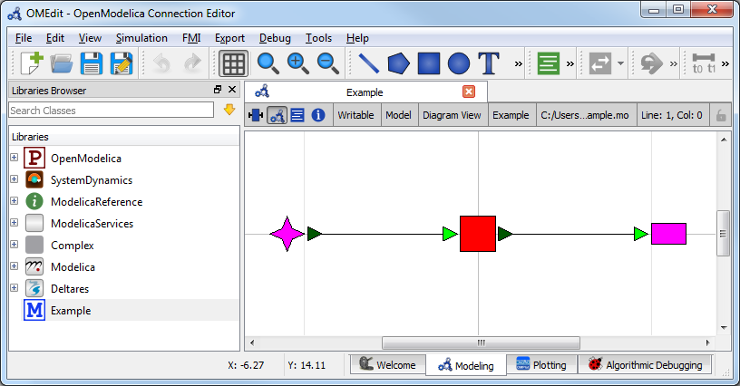

Using Lookup Tables
~~~~~~~~~~~~~~~~~~~

.. note::

    This example focuses on how to implement non-linear storage elements in
    RTC-Tools using lookup tables . It assumes basic exposure to
    RTC-Tools. If you are a first-time user of RTC-Tools, see
    :doc:`example_basic`.

    This example also uses goal programming in the formulation. If you are
    unfamiliar with goal programming, please see
    :doc:`example_goal_programming`.

The Model
---------

.. note::

    This example uses the same hydraulic model as the basic example. For a
    detalied explaination of the hydraulic model, see :doc:`example_basic`.

In OpenModelica Connection Editor, the model looks like this:

In text mode, the Modelica model is as follows (with annotation statements
removed):

.. literalinclude:: _build/mo/lookup_tables.mo
  :language: modelica
  :lineno-match:

The Optimization Problem
------------------------

The python script consists of the following blocks:

* Import of packages
* Declaration of Goals
* Declaration of the optimization problem class

  * Constructor
  * Declaration of a ``pre()`` method
  * Specification of Goals
  * Declaration of a ``priority_completed()`` method
  * Declaration of a ``post()`` method
  * Additional configuration of the solver

* A run statement

Declaring Goals
'''''''''''''''

Goals are defined as classes that inherit the ``Goal`` parent class. The
components of goals can be found in :doc:`multi_objective`.

First, we have a high priority goal to keep the water volume within a minimum
and maximum. We use a water volume goal instead of a water level goal when the
volume-storage relation of the storage element is non-linear. The volume of
water in the storage element behaves linearly, while the water level does not.

However, goals are usually defined in the form of water level goals. We will
convert the water level goals into volume goals within the optimization problem
class, so we define the ``__init__()`` method so we can pass the values of the
goals in later.

.. literalinclude:: ../../case-studies/lookup_tables/src/example.py
  :language: python
  :pyobject: WaterVolumeRangeGoal
  :lineno-match:

We also want to save energy, so we define a goal to minimize ``Q_release``. This
goal has a lower priority.

.. literalinclude:: ../../case-studies/lookup_tables/src/example.py
  :language: python
  :pyobject: MinimizeQreleaseGoal
  :lineno-match:

Importing Packages
''''''''''''''''''

For this example, the import block is as follows:

.. literalinclude:: ../../case-studies/lookup_tables/src/example.py
  :language: python
  :lines: 1-10
  :lineno-match:

Optimization Problem
''''''''''''''''''''

Next, we construct the class by declaring it and inheriting the desired parent
classes.

.. literalinclude:: ../../case-studies/lookup_tables/src/example.py
  :language: python
  :pyobject: Example
  :lineno-match:
  :end-before: """

The method ``pre()`` is already defined in RTC-Tools, but we would like to add
a line to it to create a variable for storing intermediate results. To do this,
we declare a new ``pre()`` method, call ``super(Example, self).pre()`` to ensure
that the original method runs unmodified, and add in a variable declaration to
store our list of intermediate results.

We also want to convert our water level rane goal into a water volume range
goal. We can access the spline function describing the water level-storage
relation using the ``lookup_tables()`` method. We cache the functions for
convenience. The ``lookup_storage_V()`` method can convert timeseries objects,
and we save the water volume goal bounds as timeseries.

.. literalinclude:: ../../case-studies/lookup_tables/src/example.py
  :language: python
  :pyobject: Example.pre
  :lineno-match:

Notice that H_max was not defined in pre(). This is because it was defined as a
timeseries import. We access timeseries using get_timeseries() and store them
using set_timeseries(). Once a timeseries is set, we can access it later. In
addition, all timeseries that are set are automatically included in the output
file. You can find more information on timeseries here :doc:`basics`.

Now we pass in the goals. We want to apply our goals to every timestep, so we
use the ``path_goals()`` method. This is a method that returns a list of the
goals we defined above. The ``WaterVolumeRangeGoal`` needs to be instantiated
with the new water volume timeseries we just defined.

.. literalinclude:: ../../case-studies/lookup_tables/src/example.py
  :language: python
  :pyobject: Example.path_goals
  :lineno-match:

If all we cared about were the results, we could end our class declaration here.
However, it is usually helpful to track how the solution changes after
optimizing each priority level. To track these changes, we need to add three
methods.

We define the ``priority_completed()`` method to inspect and summerize the
results. These are appended to our intermediate results variable after each
priority is completed.

.. literalinclude:: ../../case-studies/lookup_tables/src/example.py
  :language: python
  :pyobject: Example.priority_completed
  :lineno-match:

We output our intermediate results using the ``post()`` method. Again, we nedd
to call the ``super()`` method to avoid overwiting the internal method. We can
convert volmes back into water levels using an inverted version of the lookup
table.

.. literalinclude:: ../../case-studies/lookup_tables/src/example.py
  :language: python
  :pyobject: Example.post
  :lineno-match:

Finally, we want to apply some additional configuration, reducing the amount of
information the solver outputs:

.. literalinclude:: ../../case-studies/lookup_tables/src/example.py
  :language: python
  :pyobject: Example.solver_options
  :lineno-match:

Run the Optimization Problem
''''''''''''''''''''''''''''

To make our script run, at the bottom of our file we just have to call
the ``run_optimization_problem()`` method we imported on the optimization
problem class we just created.

.. literalinclude:: ../../case-studies/lookup_tables/src/example.py
  :language: python
  :lineno-match:
  :start-after: # Run

The Whole Script
''''''''''''''''

All together, the whole example script is as follows:

.. literalinclude:: ../../case-studies/lookup_tables/src/example.py
  :language: python
  :lineno-match:

Running the Optimization Problem
--------------------------------

Following the execution of the optimization problem, the  ``post()`` method
should print out the following lines::

    After finishing goals of priority 1:
    Level goal satisfied at 6 of 12 time steps
    Integral of Q_release = 47.69

    After finishing goals of priority 2:
    Level goal satisfied at 7 of 12 time steps
    Integral of Q_release = 42.58

As the output indicates, while optimizing for the priority 1 goal, no attempt
was made to minimize the integral of ``Q_release``. The only objective was to
minimize the number of states in violation of the water level goal.

After optimizing for the priority 2 goal, the solver was able to find a solution
that reduced the integral of ``Q_release`` without increasing the number of
timesteps where the water level exceded the limit.

Extracting Results
------------------

The results from the run are found in ``output/timeseries_export.csv``. Any
CSV-reading software can import it, but this is what the results look like when
plotted in Microsoft Excel:

.. note::

    TODO: Plot these results

.. image:: images/lookuptable_example_resultplot.png
