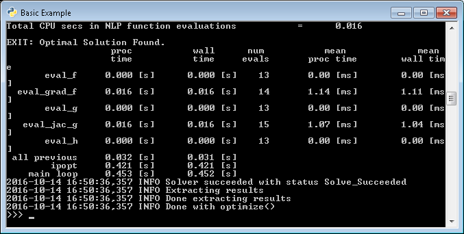

Getting Started
+++++++++++++++

Installation
============

For most users, the easiest way to install RTC-Tools using the `pip <https://pip.pypa.io/>`_ package manager.

Using the Pip Package Manager
-----------------------------

RTC-Tools, including its dependencies, can be installed using the `pip <https://pip.pypa.io/>`_ package manager::

    # Install RTC-Tools using pip package manager
    python3 -m pip install rtctools

From Source
-----------

Although not required, it is recommended to build and install RTC-Tools in a `virtual environment
<https://virtualenv.pypa.io/en/stable/>`_.

Dependencies
~~~~~~~~~~~~

RTC-Tools 2 requires `Python <https://www.python.org>`_ >= 3.6 (*not Python 2*) with the following packages:

  - `numpy <https://www.numpy.org/>`_ >= 1.11.10

  - `pymola <https://github.com/jbaayen/pymola/>`_

  - `CasADi <https://github.com/casadi/casadi/>`_ >= 3.2.0

The dependencies can be installed using the `pip <https://pip.pypa.io/>`_ package manager::

    # Install dependencies using pip
    python3 -m pip install numpy pymola casadi

Acquiring the source
~~~~~~~~~~~~~~~~~~~~

The latest RTC-Tools source can be downloaded using git::

    # Get RTC-Tools source
    git clone https://gitlab.com/deltares/rtc-tools.git

    # Get RTC-Tools's Modelica library
    git clone https://gitlab.com/deltares/rtc-tools-channel-flow.git

Linux/MacOS-X
~~~~~~~~~~~~~

To actually build and install RTC-Tools, run::

    # Build and install RTC-Tools
    python setup.py install

To check whether the installation was succesful, the basic example can be
used.  Only the environment variable pointing to the
Deltares Modelica library remains for the user to set::

    export DELTARES_LIBRARY_PATH=\`readlink -f ../rtc-tools-channel-flow\`

    cd examples/basic/src

    # Set the correct environment variables, and run the example
    python3 example.py

Windows
~~~~~~~

To check whether the installation was succesful, the basic example can be
used. Only the environment variable pointing to the
Deltares Modelica library remains for the user to set::

    set DELTARES_LIBRARY_PATH=C:\path\to\rtc-tools-channel-flow

    cd /D C:\path\to\rtc-tools\basic\src

    # Set the correct environment variables, and run the example
    python3 example.py

If the installation was succesful, you should see that the solver succeeds:

.. _getting-started-omedit:

Getting OMEdit
==============

RTC-Tools uses the Modelica language to describe the mathematics of the system
we wish to optimize. There are several editors for Modelica models, but the
OpenModelica Connection Editor, or OMEdit, is a free and open-source graphical
connection editor that can be used to construct RTC-Tools models. To download it
for windows, click here: https://www.openmodelica.org/download/download-windows

Once installed, you can start OMEdit by clicking::

   Start -> All Programs -> OpenModelica -> OpenModelica Connection Editor

With OMEdit installed, you can start using it by following along with the basic
example, :doc:`examples/basic`.

.. _running-rtc-tools:

Running RTC-Tools
=================

RTC-Tools is run from a command line shell. If you installed using the Windows
executable, the RTC-Tools Shell can be started by clicking::

    Start -> All Programs -> RTC-Tools -> Shell

Once you have started the shell, navigate to the ``src`` directory of the case
you wish to optimize, e.g.::

    cd \path\to\RTCTools2\examples\basic\src

Then, to run the case with RTC-Tools, run the ``src`` python script, e.g.::

    python example.py

You will see the progress of RTC-Tools in your shell. All your standard shell
commands can be used in the RTC-Tools shell. For example, you can use::

    python example.py > log.txt

to pipe RTC-Tools output to a log file.
